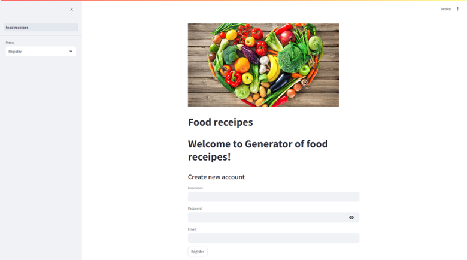
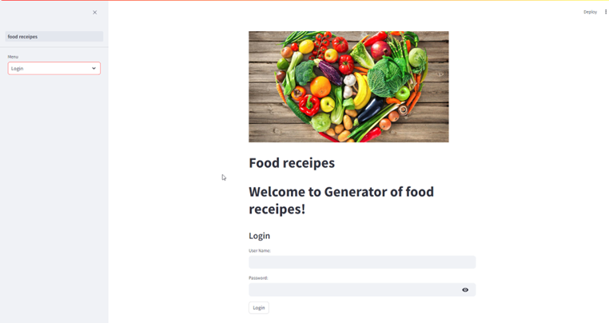
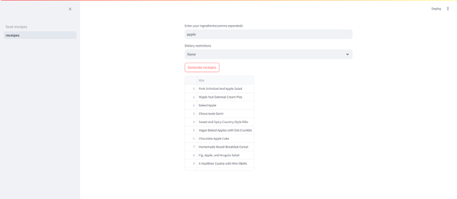

# Food receipe app

### An application that helps you to cook your own meal with ingredients that you have in the fridge.
Food receipe app uses SQLite3 as a DB and also Spoonacular API.

Spoonacular API is food and recipes API, allowing you to scrape web data from an online database with hundreds of thousands of recipes, products and ingredients. Using Python, I wrote a script that takes user input (what ingredients do you have? What are your dietary requirements?), sends a request to the API, and then returns a tailored list of recipes.

#### GitHub url:
>https://github.com/sorinacizer/Food-receipes.git

### How to see different receipes made with your chosen ingredients:
1. Register

2. Login

After you are logged in, you can enter your desired ingredient to see what receipes you can do.

